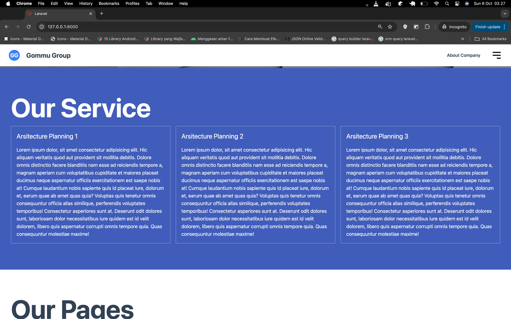
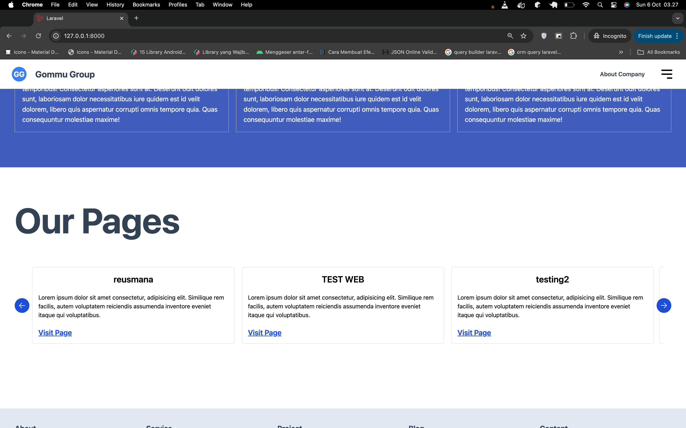
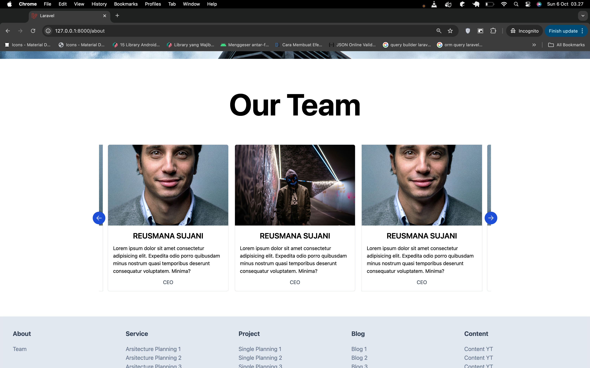
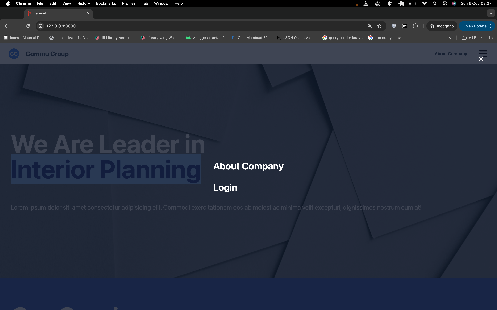
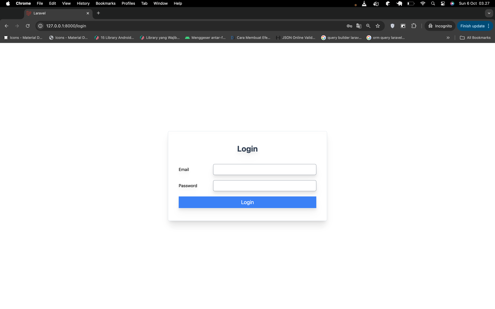
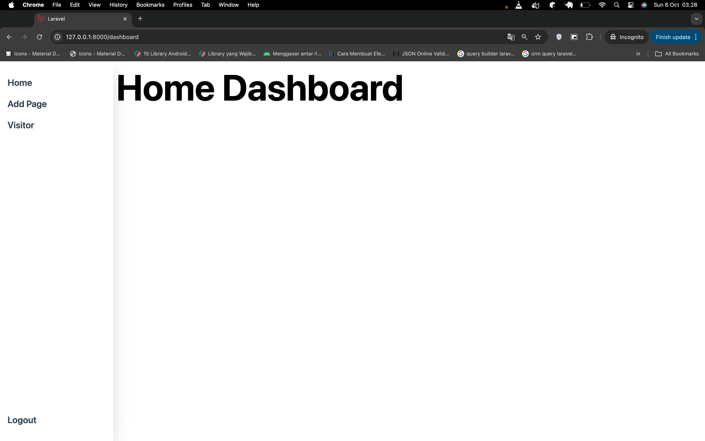
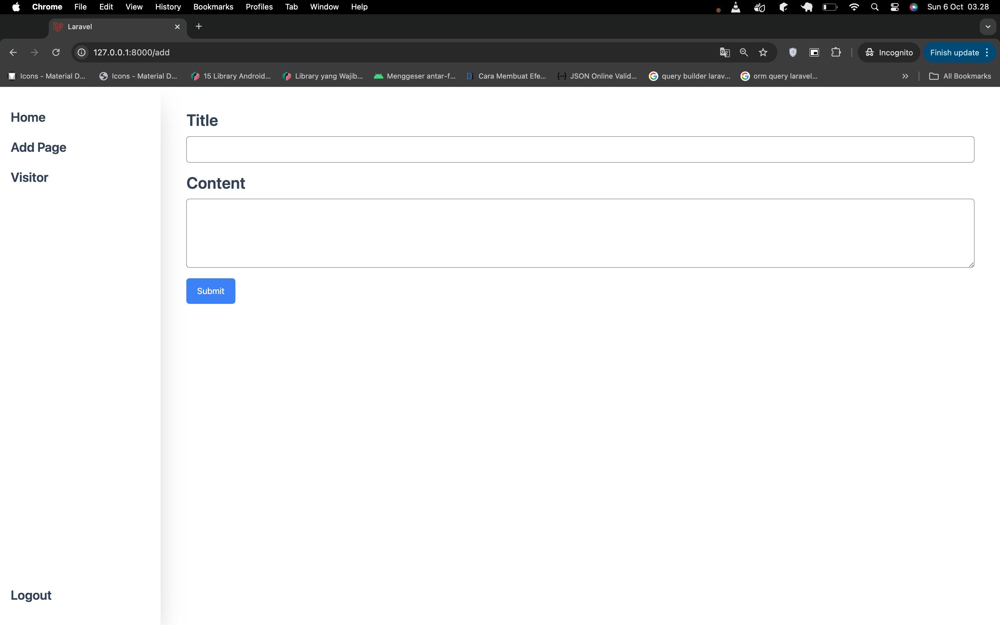
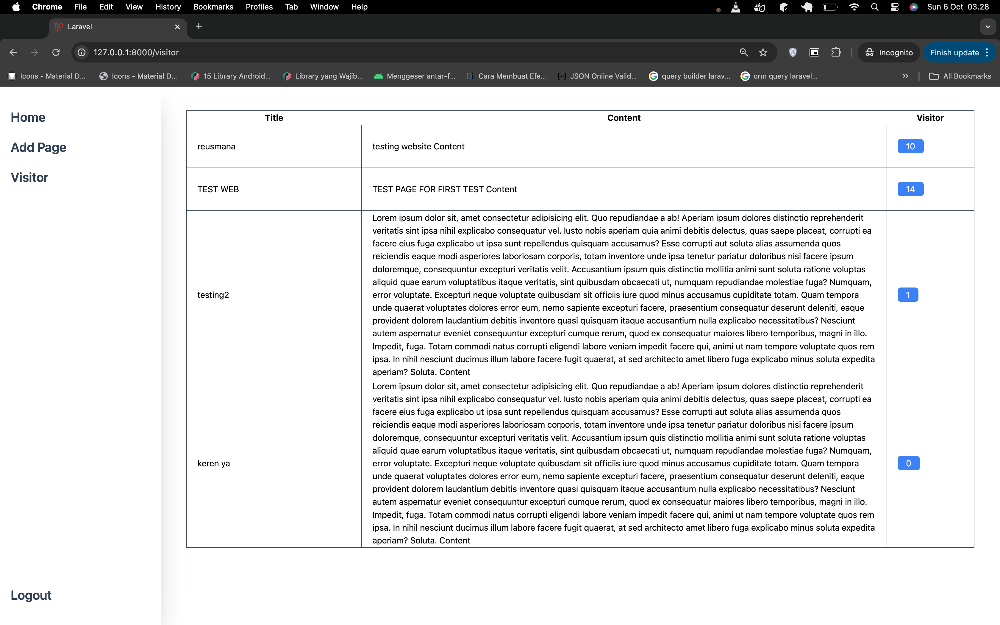

# Documentation

# running app

```
php artisan migrate
php artisan db:seed
```

```
npm run build
npm run dev
```

then open new terminal then copy and paste
this command prompt

```
php artisan serve
```

## this is picture example app


















